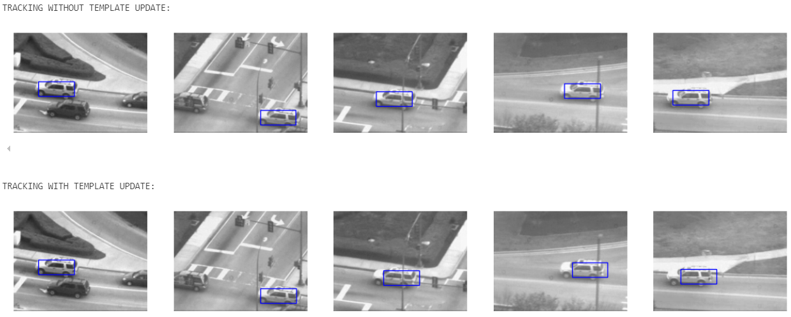
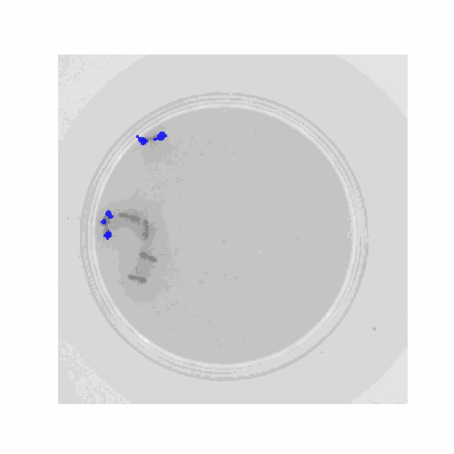
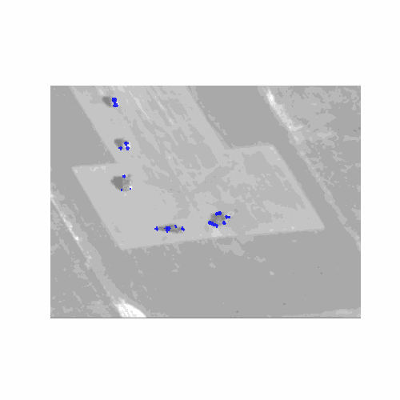

# Lucas-Kanade Object Tracking

This project implements the Lucas-Kanade algorithm for object tracking, with three different approaches:

- **LucasKanade**: Standard Lucas-Kanade tracking assuming a static camera.
- **LucasKanadeAffine**: Extends the method to account for affine transformations, allowing for camera motion.
- **LucasKanadeEfficient**: Implements the inverse compositional method for improved computational efficiency.

## Overview

The Lucas-Kanade algorithm is a classic method for optical flow estimation, tracking objects by minimizing the intensity difference between consecutive frames. It assumes that the pixel intensity remains constant over small displacements, leading to the fundamental equation:

$$I(x + \Delta x, y + \Delta y, t+1) \approx I(x, y, t) + \nabla I \cdot \Delta p$$

where $\nabla I$ is the image gradient and $\Delta p$ is the displacement vector. The solution is obtained by solving the least-squares problem:

$$\Delta p = (A^T A)^{-1} A^T b$$

where $A$ contains image gradients and $b$ represents intensity differences.

## Implementations

### 1. LucasKanade (Translation Only)
This version tracks an object assuming a purely translational motion. The transformation is modeled as:

$$W(x; p) = x + p$$

which results in a simple identity Jacobian matrix.

**Example result:**

In conclusion, our analysis suggests that updating the template in the next frame did not improve tracking performance in this scenario. It appears that the presence of other vehicles and traffic lights could cause temporary obstructions in the image frame, potentially confusing the tracker if the template were updated. As discussed in class, a more robust approach would involve a life-model-based tracking system that learns in real-time from all previous frames, accounting for potential occlusions and minimizing the risk of losing track of the object due to motion blur or unclear frames.

Curious about the accuracy of this hypothesis, I decided to investigate where the tracking error (measured by the mean squared error between the rectangle corners) increased significantly. Upon plotting the error over time, I observed a notable gap in the error when the car passed behind a traffic light, which caused a temporary loss in tracking. This highlighted that the tracking system struggled during brief occlusions, reinforcing the idea that dynamic, adaptive systems could perform better in such challenging scenarios.

### 2. LucasKanadeAffine (Affine Transformation)
This approach extends tracking to affine transformations, where motion is described by:

$$W(x; p) = M x^*$$

with $M$ being a 2×3 affine matrix. The Jacobian now accounts for scaling, rotation, and shearing.

**Result:**

### 3. LucasKanadeEfficient (Inverse Compositional)
The inverse compositional method optimizes computation by precomputing certain terms, significantly improving efficiency. Instead of updating $p$ additively, it updates the warp function via composition.

**Result:**

Same a LucasKanadeAffine but with a big improvement in time complexity

|   | Composition | Inverse composition |
|---|-----|--------|
| Ant | 44s | 21s |
| Aerial | 103s | 58s | 

## Usage
Each implementation is provided as a Jupyter Notebook:
- `LucasKanade.ipynb`
- `LucasKanadeAffine.ipynb`
- `LucasKanadeEfficient.ipynb`

Run each notebook to test the tracking methods on example sequences.

## References
- Lucas, B. D., & Kanade, T. (1981). An Iterative Image Registration Technique with an Application to Stereo Vision.
- Baker, S., & Matthews, I. (2004). Lucas-Kanade 20 Years On: A Unifying Framework.

---

This repository provides a comprehensive study of Lucas-Kanade tracking, progressively improving performance and efficiency through affine and inverse compositional methods.

